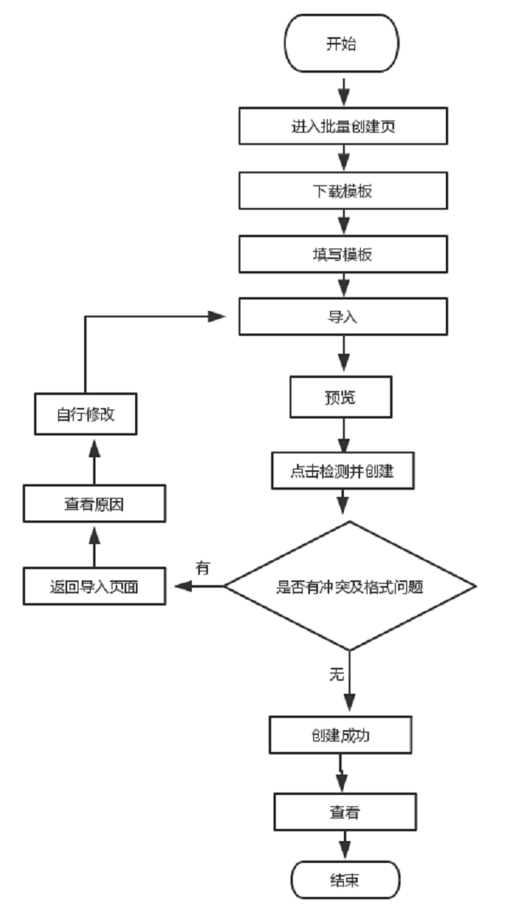

# 活动管理

## 优化查询活动条件、删除优化、新增批量创建活动
- [页面业务流程图](#页面业务流程图)
- [程序目录结构](#程序目录结构)
- [调用接口](#调用接口)
- [使用第三方插件](#使用第三方插件)
- [页面注意点](#页面注意点)

### 页面业务流程图
###### 用户人群:内部客服人员
+ 1、活动管理-查询栏优化
    + 1.1支持多条件的模糊查询
    + 1.2活动ID与活动名称具有唯一性，故共用同一文本框
    + 1.3服务器ID为文本框
    + 1.4活动类型、渠道、状态、开启方式为多选下拉框查询栏。由于活动类型较多，则为可搜索的下拉框。选项为现有的数据类型，点击可筛选出某类型的所有数据。
    + 1.5在本页面内，除点重置外或手动删除外，不对已有的筛选条件进行置空。（现点击确认会先自动重置筛选栏）
    
+ 2、活动管理 - 删除优化（活动管理->状态）
    + 2.1增加“临时关闭”
    + 2.2增加“删除”为彻底删除
    + 2.3状态：“已临时关闭” 、“已删除”，

+ 3、批量创建活动
    + 3.1支持下载《下载批量创建活动模板》
    + 3.2客服人员能够在本页面中进行活动文件的导入，简单判断是否符合条件(不无空)
    + 3.3页面预览文件数据
    + 3.4检测并创建，并提示成功或失败原因
     


[TOP](#类型管理)
### 程序目录结构

###### 视图层
```
.
├─  src/view/Activity
    ├─  ActivityList
```
Operation.vue（页面整合页）


###### API层
```
.
├─ src/api
    ├─ activity.js
        ├─ getActivities()
        ├─ deleteActivity()
        ├─ resetActivity()
        ├─ searchActivities()
        ├─ getActivitiesStatus()
        ├─ refreshStatus()
        ├─ getUnEnableActivities()
        ├─ getOngoingActivities()
        ├─ getCompletedActivities()
        ├─ getDeletedActivities()
        ├─ deleteActivityWorld()
        ├─ getActivitiesByType()
        └─ updateActivityAutoStart()
```
[TOP](#创建活动)

### 调用接口
| API名称 | 方法 | 路由地址 | 备注 |
|--------|--------|--------|--------|
|  |  |  |  |

[TOP](#创建活动)

### 使用第三方插件

**无**

[TOP](#创建活动)

### 页面注意点

###### 1.

[TOP](#创建活动)

←[类型管理](client/typeManage) 下一页[服务端开发指南](ServerDeveloper)
