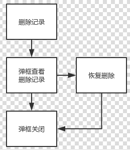

# 类型管理

## 目录
- [页面业务流程图](#页面业务流程图)
- [程序目录结构](#程序目录结构)
- [调用接口](#调用接口)
- [使用第三方插件](#使用第三方插件)
- [页面注意点](#页面注意点)

### 页面业务流程图
###### 用户人群:内部客服人员,类型管理中，出现需要恢复及查看已删除记录的需求，避免误删.
+ 类型管理-删除记录页面
     
<center>图 1.1.1</center>

[TOP](#类型管理)

### 程序目录结构

###### 视图层
```
.
├─ src/view/Activity
    ├─ ActivityType
```
###### API层
```
├─ src/api
    ├─ type.js
    ├─getTypes
    ├─updateTypes
    ├─deleteTypes
    └─createTypes
```
[TOP](#类型管理)

### 调用接口
| API名称 | 方法 | 路由地址 | 备注 |
|--------|--------|--------|--------|
|  |  |  |  |

[TOP](#类型管理)

### 使用第三方插件

**无**

[TOP](#类型管理)

### 页面注意点

###### 1.

[TOP](#类型管理)

←[客户端开发指南](ClientDeveloper) 下一页[创建活动](client/creatActivity)
