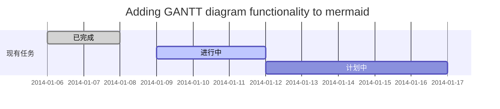
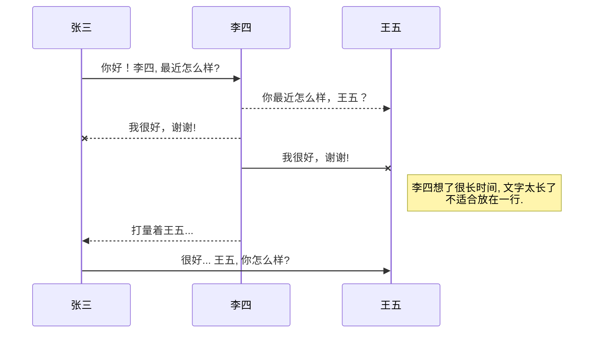
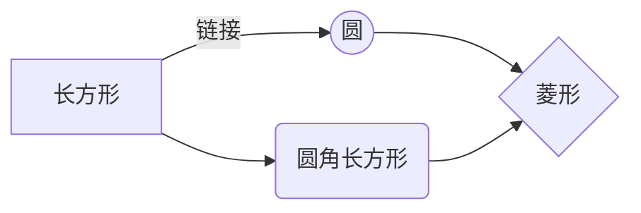

标题
---------------------------
# 1级标题
## 2级标题
### 3级标题
#### 四级标题
##### 五级标题
###### 六级标题


文本样式
---------------------------
*强调文本* _强调文本_
**加粗文本** __加粗文本__
==标记文本==
~~删除文本~~
> 引用文本
H~2~O is是液体。
2^10^ 运算结果是 1024。


列表
---------------------------
- 项目
  * 项目
    + 项目

1. 项目1
2. 项目2
3. 项目3

- [ ] 计划任务
- [x] 完成任务

链接
---------------------------
链接: [linkTo-https://github.com/zhangqijohn](https://github.com/zhangqijohn/zhangqijohn.github.io/tree/master/basis/mdStudy.md).
图片: 
带尺寸的图片: 
居中的图片: 
居中并且带尺寸的图片: 


代码片
---------------------------
```
// A code block
var foo = 'bar';
```


区块引用
---------------------------
> ## 标题
> * 不以结婚为目的的谈恋爱都叫耍流氓
>  > 这是毛主席说的


表格
---------------------------

| Column 1 | Column 2      |
|:--------:| -------------:|
| centered 文本居中 | right-aligned 文本居右 |


自定义列表
---------------------------
Markdown
:  Text-to-HTML conversion tool

Authors
:  John
:  Luke


注脚
---------------------------
一个具有注脚的文本。[^1]

[^1]: 注脚的解释

注释
---------------------------
Markdown将文本转换为 HTML。

*[HTML]:   超文本标记语言

LaTeX 数学公式
---------------------------
[参考文档](https://khan.github.io/KaTeX/)

Gamma公式展示 $\Gamma(n) = (n-1)!\quad\forall
n\in\mathbb N$ 是通过 Euler integral

$$
\Gamma(z) = \int_0^\infty t^{z-1}e^{-t}dt\,.
$$

插入甘特图
---------------------------
[参考文档](https://mermaidjs.github.io/#/gantt)



插入UML图
---------------------------
[参考文档](https://mermaidjs.github.io/#/sequenceDiagram)



插入Mermaid流程图
---------------------------
[参考文档](https://mermaidjs.github.io/#/flowchart?id=graph)



插入Flowchart流程图
---------------------------
[参考文档](http://flowchart.js.org/)

```mermaid
flowchat
st=>start: 开始
e=>end: 结束
op=>operation: 我的操作
cond=>condition: 确认？

st->op->cond
cond(yes)->e
cond(no)->op
```
